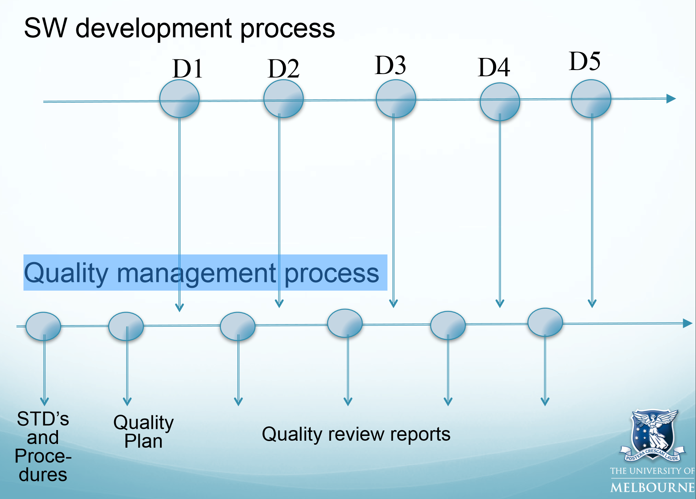

# Quality Assurance

_updated at: 2017-05-23-10-09_

+ ~~Quality Assurance~~
    + ~~to achieve quality standards~~
        * ~~quality standards~~
            - ~~one of the constraints~~
                + ~~other constraints~~
                    * ~~budget~~
                    * ~~resource~~
                    * ~~product~~
                    * ~~organizational~~

## Quality
+ ~~is an attribute (that can be broken into some attributes) and is measurable~~
+ cannot post-hoc / after building the system
+ need to be Built into the Design (at the beginning)
+ Measuring quality gives
    * quality of design
    * quality of conformance
+ the quality of the process influences the quality of the product
    * If a software engineer cannot directly monitor the quality attributes of the product
        * then they will often instead monitor the quality attributes of the processes used
+ Perspective on quality
    * The end user perspective - ultimately matters
        - external quality characteristics
            + fit for purpose
            + reliable
            + reasonable performance
            + easy to learn and use
            + help user in achieving their goal
    * The developer’s perspective -  increases the likelihood to satisfy the end user
        - internal quality characteristics - easy to understand and maintain for developers and maintainers, so that less likely to make mistakes, and can focus on increasing quality with respect to the end user
            + num of faults
            + ease of modifying the system
            + ease of testing the system
            + the ease of understanding the system design
            + the re-usability of components
            + conformance to requirements
            + resource usage
            + performance
- quality dependent on the perspective, interpretation, and expectations of individuals
    +  difficult to measure or assess directly
        *  wanna remove bias and be more objective
            - use quality models
                + to decompose quality into a number of attributes which can be measured or evaluated more objectively
        
### Quality models
+ a relatively abstract characterisation of quality
    * Meets explicit functional & non-functional req’s
        - correct, complete, consistent
    * Adhere internal & external standards
    * Meets implicit quality req’s
        - req's for performance - reliable, usable, extendable ...
+ ~~example~~
    * ~~McCall’s quality model~~
    * ~~ISO9126~~

### SW quality dilemma
+ which process and activities are worthwhile to apply in order to achieve software quality
    * why ask
        - quality assurance has a cost
            + ~~salary~~
            + ~~software licenses~~
            + ~~hardware~~
            + ~~time~~
        - lack of quality also has a cost
            + ~~user to deal with low quality~~
            + ~~supplier to knock-on~~
                * ~~potential users don't choose~~
                * ~~current user don't upgrade~~
            + ~~supplier to maintain~~
                * ~~faults more common~~
                * ~~hard to make changes~~
                    - ~~correcting fault~~
                    - ~~adding new features~~
                    - ~~re-factoring~~
    + answer
        * good enough (e.g. more-used more reliable / no known faults)
            - need to estimate
                + cost of the quality assurance activities
                + the cost of the possible risks

### The cost of quality
+ too costly?
    * ~~e.g.~~
        + ~~no formal team reviews, ask user instead for feedback and correct faults~~
        + ~~release the system and correct errors as users find/report them~~
    * Studies indicate that
        * later a fault is detected (in SDLC)
            * more costly to locate and repair

## Quality & Process
+ how to change if proj often lacking 1 or more quality attributes
    * ~~hire better developers?~~
        * ~~there aren't many~~
    + change the processes (change how to build the proj)
- The quality of the product depends on the quality of the process.
    + the process can be defined, managed, measured, and __improved__
        * Improve quality through improving quality attributes 
            - ~~means employing a more suitable process~~
- to achieve quality
    + must be practical
        * decide which quality attributes are the most important
            - so
                + more effort and resources
            - but
                + do not neglect the others
            * must
                * Decide upon targets for process measures
                    - ~~e.g. acceptable defect rates from inspections of code or inspections of designs~~
                * Decide upon targets for product measures
                    - ~~e.g. the target reliability or performance estimates for you system~~
        + if targets not met
            * reduce your targets
            * or change the processes (preferably)
        + ~~not simply because the standard requires it but understand why needed and make sure that they fits with the goal~~
+ Improving quality via process improvement
    * improve the quality of our processes
        - Capability Maturity Model (CMM)
            + aims to provide an assessment of the Process Maturity Model
                * ~~how well the processes are defined~~
                * ~~how well the processes are understood~~
                * ~~how well the processes are applied~~
            + ~~rating~~
                * ~~Initial~~
                * ~~Repeatable~~
                * ~~Defined~~
                * ~~Managed (measure and predict)~~
                * ~~Optimised~~

## ~~Quality Mngment~~
+ ~~Checks project deliverables~~
+ ~~Manage release testing process~~
+ ~~~~
+ ~~Quality Plan~~
    * ~~Product introduction~~
    * ~~Product plans~~
    * ~~Process descriptions~~
    * ~~Quality goals~~
    * ~~Risks and risk Management~~
    * ~~Quality Assurance~~

## Quality Assurance
+ __monitoring and evaluation__ of the various aspects of a project, service, or facility to ensure that __standards__ of quality are being met.
+ != guarantee
    * ~~only to provide a high level of assurance, or a high degree of confidence~~
        - ~~that the program meets the needs~~
+ != quality control
    * quality assurance
        - to improve quality during development
    * quality control
        * testing a product before its release
        - to decide whether to release
+ ~~ability to exert control over the level of assurance~~
    * ~~important~~
    * ~~distinguishes engineering from ad-hoc development~~
    * ~~need to understand the quality attributes~~
    * ~~have methods to build these attributes~~
+ main methods for assuring quality 
    * Testing and Measurement
        - ~~dynamic execution of a system to~~
            - ~~finding faults (testing functional requirements)~~
            - ~~measuring whether the system meets its non-function requirements~~
    * Audits
        - reviews of processes and teams to
            + determine if a particular product or process conforms to standards
        - assesses whether a given artifact complies with a specified standard or process
            + does not aim to find defects in logic or meaning of an artifact
        - difference from a peer review or technical review
            + authors not involved at all
            + performed by an external team
        - types
            + product audits
                * assesses whether a product complies with a standard
            + process audits
                * assesses whether a team is following specified processes
        + more objective than technical reviews
            * a team is following a process or not
                - ~~lack of evidence can be a sign~~
    * Technical reviews
        - reviews of artifacts performed by __peers__ to
            + uncover problems/defects in an artifact
            + determine the quality of an artifact
                + e.g stable
            + and seek ways to improve the artifact
        - soft
            + nothing is executed
        - but useful
            + Reviews can be performed on any software artifacts
                * hard ones (e.g testing & measurement) can be performed only on executable artifacts
            + Early reviews saves costs, can find faults before testing & measurement
            + programmers make more mistakes when correcting faults found during testing than review
                * ~~due to internal pressure of getting software released~~
            + Review fault detection rate is high
            + Reviews find the actual faults in source code
                + testing merely indicates "somewhere" and needs locating the fault
        * a type of __peer review__
            - userful
                + different assumptions & understanding
                + people rarely find their own faults and problems
            - ~~but authors most definitely should review their artifacts before passing them on for peer review.~~
* peer reviews
    + Informal reviews
        + technical review is informal according to W11L2 slides
        * Simple Desk Check /casual meeting with a colleague
            * look over sth and provide feedback
        * Aims to improve quality of a document
        * no formal guidelines or procedures
        * Less effective than formal reviews
            - lack of
                + diversity found in a group
                + focus by the reviewer
            * Checklists can help to improve the effectiveness
                - ~~a list of generic questions about an artifact~~
                - ~~a generic checklist for requirements specifications~~
    + Formal reviews