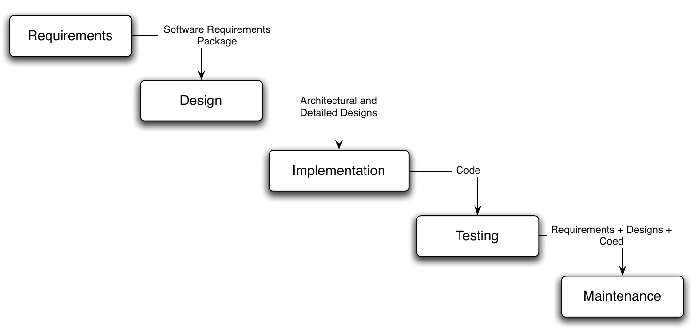
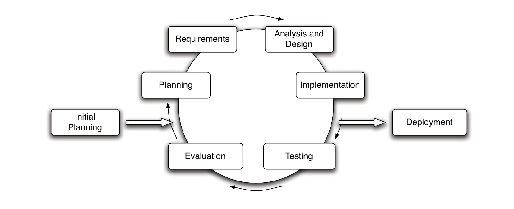
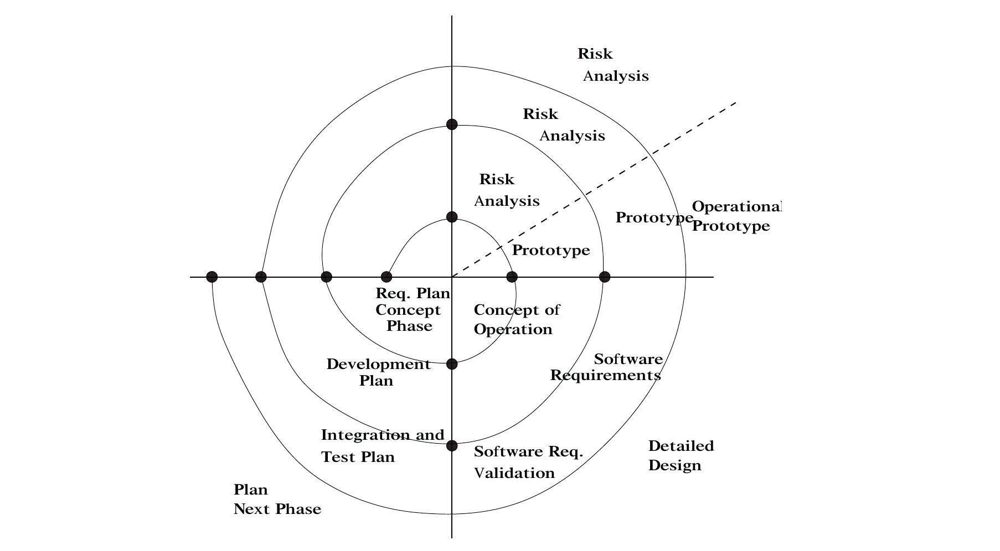

# Week 2  Software Development Life Cycle Models

_updated at: 2017-05-29-19-15_

## Motivation SDLC models
+ SDLC
    + Software Development Life Cycle
        * describe a process (a num of phases) for planning, designing, building, testing and deploying an information system.
    + high-level process
    + there's no a perfect one
        * need to decide an appropriate one
    + artifacts
        * as outputs
        * as inputs
    + when designing a process         
        * start with lifesycle model
        * add in activities for special consideration
        * What steps do we need to take to produce the outputs from the inputs? 
        * What techniques and tools can be applied? 

## Activities/phases in software development
+ Requirements engineering
    * eliciting the requirements for the system, analysing and defining these requirements using models, and validating the requirements.
    * _output: SRS, Software Requirement Specification_
    * 
+ design
    * System/architectural design
        - _architecture = structure + activities_
            - _components and their connections & iteractions_
    * Detailed design
+ Development(Implementation)
+ Integration
+ Testing
    + [Unit Test? Integration Test? Regression Test? Acceptance Test?](http://stackoverflow.com/questions/7672511/unit-test-integration-test-regression-test-acceptance-test)
    + [What is Unit test, Integration Test, System test, Regression Test?](http://stackoverflow.com/questions/520064/what-is-unit-test-integration-test-smoke-test-regression-test)
    * _unit testing_
    * _integration testing_
    * _regression testing_
    * _acceptance testing_
    * _system testing_
+ Delivery and release
+ Maintenance

## Prescriptive(formal) models
+ waterfall
    * 
    * not widely used nowadays
    * pros
        - easy to track 
        - easy to control
        - quantifiable
    * cons
        - complete a phase before moving onto the next
        - cannot go back
        - takes a long time to know whether it works or how it looks like
        - resource isolation
+ modified waterfall
    * revist based on feedback
    * 
+ V model
    + to develop better testing processes
    * attempts to __overcome__ the weakness described above in the waterfall model by performing the __various levels of testing__ in parallel with the artifacts against which the testing occurs.
    * _shows exactly which testing activities correspond to each of the analysis (concept and requirements) and decomposition (architectural and detailed design) activities_
    * 
+ iterative
    * aim to deal with __uncertainty__ and __changing__ project environments
        - manage the risk of changing and uncertain environments by aiming to release and gain feedback __often and early__. 
    * broken up into a number of iterations
    * a reworking development strategy to revise and improve parts of the system leaving time alone
    + according to Sanika's post on discussion board, both incremental and evolutionary are iterative
    * incremental
        - 
        - divide the development into a fixed number of increments each involving a planning, requirements, design, implementation and testing phases (so each increment needs to be a complete and usable subset, to be deployed and evaluated)
        - Each increment may follow a mini-waterfall or other process.
        - pros
            + more flexibility
            + reduce risks in a changing env
        - cons
            + hard to choose increment
            + can get complex
            + integration can be hard
            + needs to well managed
        - diff between incremental and iterative process though similar
            + incremental
                * divided into a fixed number of increments
                * dev different parts of the system at __different times/rates__ then integrate
            + iterative
                * broken up into a number of iterations
                * a reworking development strategy to revise and improve parts of the system __leaving time alone__

    + evolutionary
    * spiral
        - 
        - a type of iterative model in which each iteration has distinctive sequence of activities that are designed to manage __risk__.(__risk-driven__, suitable for prone-to-risk/high-risk/complex projects)
        - Unlike the incremental approach, each iteration typically involves __risk analysis__, __prototyping__ to determine the feasibility and desirability of various __alternatives__, and then design, coding and testing.

## Agile models
+ features
    * focus on the __code__ rather than the more formal processes
    * based on an __iterative__ approach to software development
    * intended to __deliver__ working software __quickly__ and to __evolve__ the working software __quickly__ to meet __changing requirements__.
+ principle (refered to when looking into XP and Scrum)
    + Incremental delivery
    + Customer involvement
    + People over process
    + Embrace change
    + Maintain __simplicity__

### Extreme Programming, XP, one of widely used agile
+ __short__ iterations, short cycle time
    + two weeks at most
    - __Incremental__ development is supported by small, frequent system releases
- __Clients__ need to be involved with the project and to be available for evaluating the system when it is released
    + to keep __cycle time short__
    + obvious __downside__
        * The customer is required to provide a representative to the project in a full-time role
- Unlike the formal processes, it is __people__, not process, that are the focus of XP
    + pair programming
    + collective ownership
    + avoid long working hours
- __Change__ is supported through regular system releases and client availability
- __Simplicity__ is maintained through code __re-factoring__
- run all tests on every build and only accepting a build if all test are passed
* a lot of discipline, __actually not easy to follow!__

### Scrum, most popular agile by far
+ 
+ more high-level project life cycle and management process than XP
    * share commonalities
        - short development iterations
            + called Sprint in Scrum
                * 2-4 weeks
                * must finish at the specified time, no chance of an extension
        - being prepared to respond quickly to change
+ iterative, incremental
+ Scrum Team
    + Product Owner
        * represents the customer/stake-holders
        * writes user requirements in the form of __User Stories__
            - User Stories then added to __Product Backlog__
                - these requirements are prioritised
                - At the start of each sprint, during a Sprint Planning Event, the team decides which requirements form the product backlog can be implemented in the sprint
                    - recorded in the __Sprint Backlog__
                        + sprint backlog cannot be changed by anyone during the sprint
                        + product backlog can be changed at any time
    + Scrum Master
        * facilitates the sprint
            - _responsible for resolving any impediments the development team might face that could impact the sprint, and also ensures that the Scrum framework is followed._
        * and is responsible for product goals and deliverables
    + Dev Team
+ Daily Scrum
    * ~~15-min meeting~~
        - ~~3 questions~~
            + ~~do what yesterday~~
            + ~~do what today~~
            + ~~any impediments~~
        - ~~purpose~~
            + ~~what done~~
            + ~~done by who~~
            + ~~what to remians to be done~~
                + ~~ask team members make commitments to each other~~ 
- After the sprint is complete
    * Sprint Reviewing Meeting
        - ~~typically 3 hrs~~
        - the team review the work that was completed and present it to the customer
    * Sprint Restropective
        - ~~typically 3 hrs~~
        - the team reflect on the sprint and discuss what went well during the sprint, and what improvements they can make for future sprints
