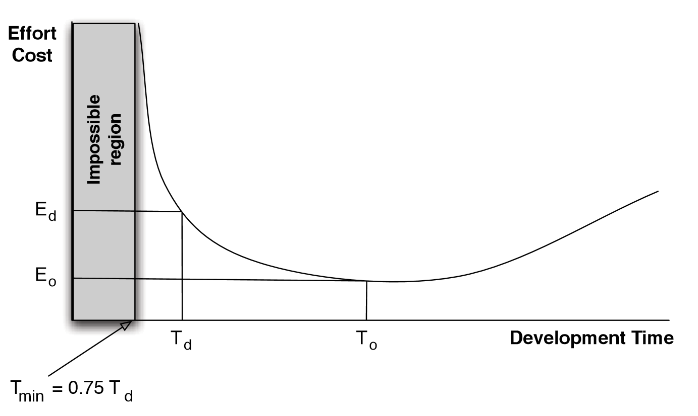
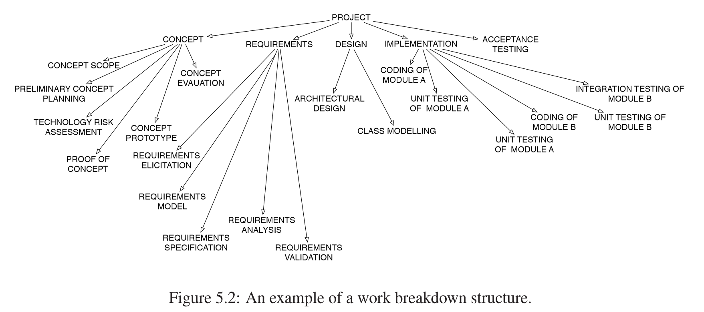
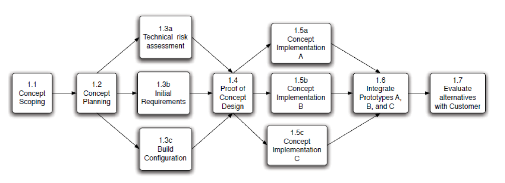
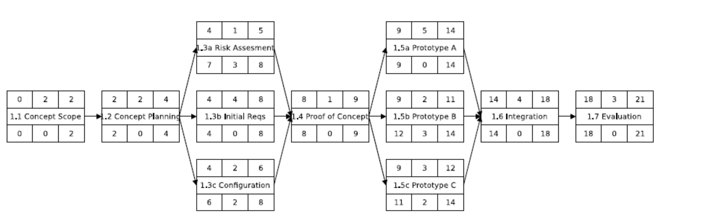
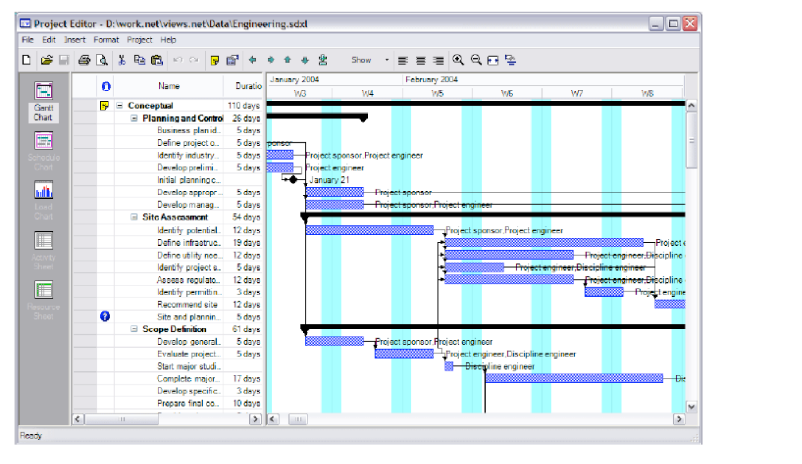
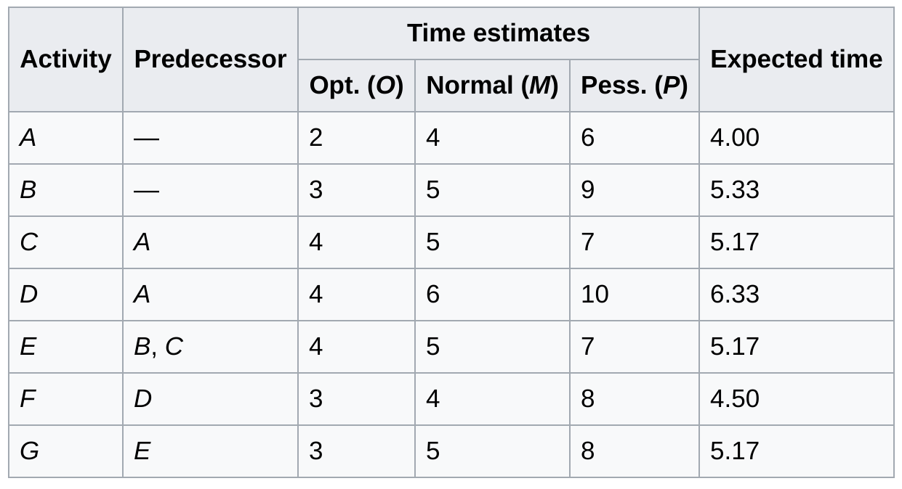
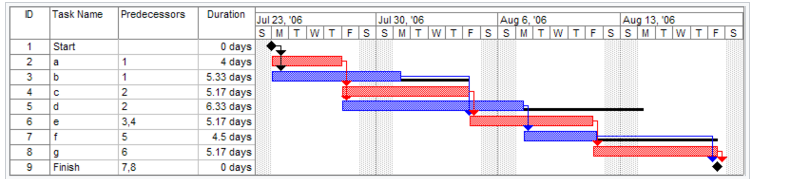

# Planning and Scheduling

_updated at: 2017-05-23-21-09_

## Project Plan
* proj mng plan `!=` proj plan
    - PMP contain all plans
    - proj plan is just about the schedule
+ What does it include
    * the __task__ that need to be carried out as part of the processes that are being followed
    * the __duration__ and __dependencies__ for each task
    * the __people__ and __physical res__ required by each task
    * __milestones__ or __goals__ of each task
        - milestones: particular __important__ achievements
            + to track progress
+ why do it
    * to analyse the people, projects and processes early in the planning phases of a project to arrive at more realistic schedules
        - ~~if estimated schedule exceeds the given deadline~~
            + ~~discuss with the client~~
                * ~~if schedule modification not accepted~~
                    - ~~prefer iterative or incremental models with management structures that support shorter deadlines and phased delivery~~

## Basic Plainning Concepts
+ Compartmentalise
    * break down into smaller pieces
+ Interdependency
    * are there any dependencies between tasks or resources
+ Effort Estimation/Validation
+ Time Allocation
+ Responsibilities
+ Outcomes/Goals
+ Milestones

## People and Effort
+ A common measure for estimating the effort for software is _man-months_ (more generally _person-months_)
    * person-moths
        - the time in months for a single person working full time to complete the tasks
    * The Mythical Man-Months
        - ~~man-months is a misleading measure to estimate software~~
        - ~~adding people to a project that is behind schedule could result in more
        disruption and more delay~~
            * ~~because~~
                * ~~unfamiliarity~~
                    - ~~need to help new people~~
                * ~~more communication channels~~
    - A common myth is that if a project is behind schedule then the schedule can be shortened simply by adding more resources
    * Putman-Norden-Rayleigh curve
        - ~~waste effort? time?~~
        - 
        - dev time too long, effort cost goes up
        - empirical

## Project Scheduling

### Work Breakdown
+ start by choosing the SDLC
+ Breakdown the work tasks 
    * e.g. waterfall model
        - Concept
        - Requirements
        - Design
        - Impl
        - Acceptance Testing
    + results in __Work Breakdown Structure__
        + 
        - 100% rule
            + to define the work breakdown structure
            + Work breakdown structure includes 100% of the work defined by the project scope and captures all deliverables ~~— internal, external, and interim — in terms of the work to be completed, including all project management.~~
                * ~~not always possible in the early stages~~
                    - ~~as new work-packages are identified then they must all be built into the existing work breakdown structure and into the project plan~~

### Dependencies
+ Dependencies are caused by:
    * a task needs a work product produced by another task
    * a task relies on a work product (developed by another task) to be in a specific state before it can commence
    * a task needs resources used by another task
+ __Task Network__ captures the dependencies between tasks

### Task Network
+ 

### PERT and Gantt
+ to answer
    - how long will the sys take to dev
    - how much will it cost
* Two widely used graphical notations 
    - Activity charts
        + show the dependencies between tasks and show the critical path for the project
    - Barcharts
        + show the schedule of tasks against calendar time
        + such as Gantt charts
            * ~~presents the same kind of information as a PERT chart except that it shows the duration of each activity against calendar time, which PERT charts do not~~
            * ~~a tabular representation of the project schedule~~
                * ~~can be used to present a large amount of information in a relatively compact form~~

#### Important concepts
+ Milestone
    * represent the completion of an activity or the delivery of work-product
    * ~~an event that takes zero time~~
+ Activity
    * part of a project that requires resources and time
+ Free float, free slack
    * the amount of time that a task can be delayed without causing a delay to subsequent tasks
+ Total float, total slack
    * the amount of time that a task can be delayed without delaying project completion
+ Critical path
    * longest possible continuous path ~~taken from the initial event to the terminal event~~
    * ~~determines the total calendar time~~
    * ~~any time delays along the critical path will delay the reaching of the terminal event by at least the same amount~~
+ Critical activity
    * any activity in the critical path
    * an activity that has 0 total float

#### PERT Charts
+ 
+ Program Evaluation and Review Technique charts
    + An activity network that shows the dependencies among tasks and the __critical path__.
    + Terminology
        - predecessor node
        - successor node
        - optimistic time (O)
            + ~~minimum possible time required to accomplish a task~~
                * ~~assuming everything proceeds better than expected~~
        - pessimistic time (P)
            + ~~maximum possible time required to accomplish a task~~
                * ~~assuming everything proceeds goes wrong~~
        - most likely time (M)
            + ~~best estimate of the time required to accomplish a task~~
                * ~~assuming everything proceeds as normal~~
        - expected time (TE)
            + ~~the average time the task would require if repeated~~
        - $TE = (O+4M+P)/6$
        - Earliest start time (ES)
        - Latest start time (LS)
        - Earliest finish time (EF)
        - Latest finish time (LF)
        - Slack time
    * node
        - 
    * dependencies
        - 

####  Gantt chart
+ A bar chart that show the schedule against a calendar
    - 
* Gantt How To
    - 
    - 

### Critical Path Methods
+ Critical path
    * path with the longest duration
    * The overall duration of the critical path estimates the total time that project will take
    * activities on the critical path have a total free slack of 0
    * any activity gets longer, the total time gets longer
        - a delay in any of the activities in the critical path will cause the project to delay
+ Shortening the project schedule (Crashing the project plan)
    + shortening the total duration of the project by shortening the critical path
        * get additional resources for the activities on the critical path to
            - remove the dependencies between activities in the critical path
            - or shorten the duration of activities in the critical path
                + don'r forget Putnam-Norden-Rayleigh curves

### Project Tracking and Control
+ ~~If the project plan has been well analysed and well developed then the activities, resources, schedule, deliverables and milestones in the project plan will allow the project manager to track the progress of the project.~~
+ a variety of ways
    + Period __reviews__ where team members report __progress__
    + __Evaluating__ the results of reviews and audits conducted as part of the software engineering process
    + Tracking formal project __milestones__
    + Comparing __actual start__ dates with scheduled start dates
    + Meeting __engineers__ and having informal discussions
    + Using a formal method like __earned value analysis__
- aim of tracking the project
    + to exercise control if there are problems 

## Common reasons for project failure
+ Unrealistic deadlines
+ Changing requirements
+ Underestimate of the efforts
+ Unmanaged risks
+ Technical difficulties
+ Human resource difficulties
+ Failure to see and act on slippage
+ Miscommunications between project staff

## Planning in agile development
+ Takes a significantly different flavour from traditional approaches
    + Detailed planning is differed __until the start__ of the iteration
        * Designed to handle __change__
        * An iteration (added, removed, or changed) includes __all phases__ (requirements, design and test)
    + planning of iterations is done on the requirements level
        * rather than on individual tasks such as designing and implementing
            - “Complete requirement X”, rather than “Design”, “Implement”, and “Test”
        + Gantt and PERT charts are considered __less useful__, except to track dependencies
        + simply a list of the tasks is valuable and lightweight
* rules
    - Plan __short__ iterations
        + give the team a measurable progress indicator
    * Produce useful functionality
    * Use “Just in time (__JIT__) planning”
        -  Only plan for iterations that will be starting in the near future
    * Use the __team__
        - all team members involved
            + ~~sense of belonging~~
            + ~~motivated to get it right~~
                * ~~coz they will have to implement the plan~~
            + ~~ensures that they do the work they want~~
                * ~~they know their strengths and preferences~~
+ agile planning not perfect
    * though better prepares teams for change by not having fixed plans
    * less likely to be effective for systems in which safety, reliability, and security are important factors 
        - the requirements need to be carefully planned
    * less suitable for teams who are geographically separated
        - Agile promote working closely together to minimise documentation