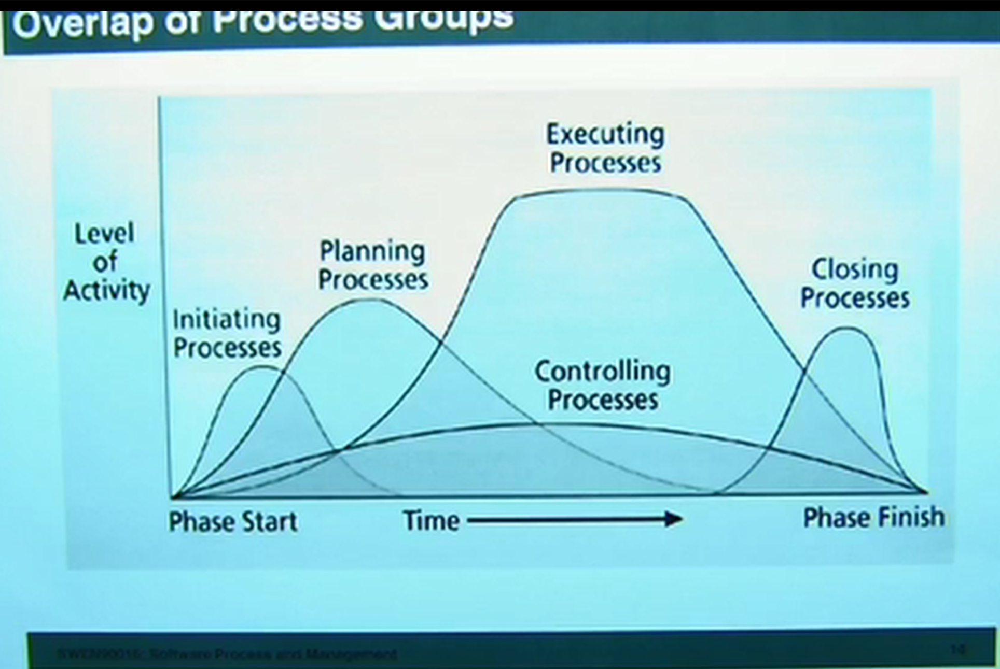
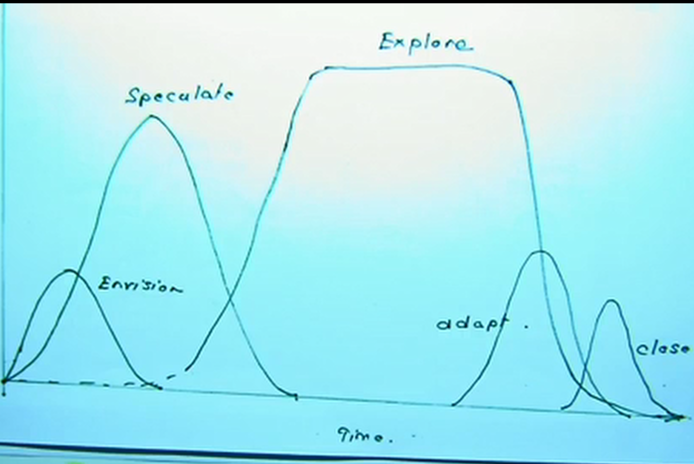

# Scrum

_updated at: 2017-05-22-21-09_

+ What is trending in IT, the knowledge industry?
    + Big Data
        * 
+ What is happening to products?
    + Quick Pivots (Re-purpose quickly)
+ Why do products?
    + Strategic Initiatives, Team Building
+ When is an Agile project a good choice

## overlap or process groups (in w6 videos)

