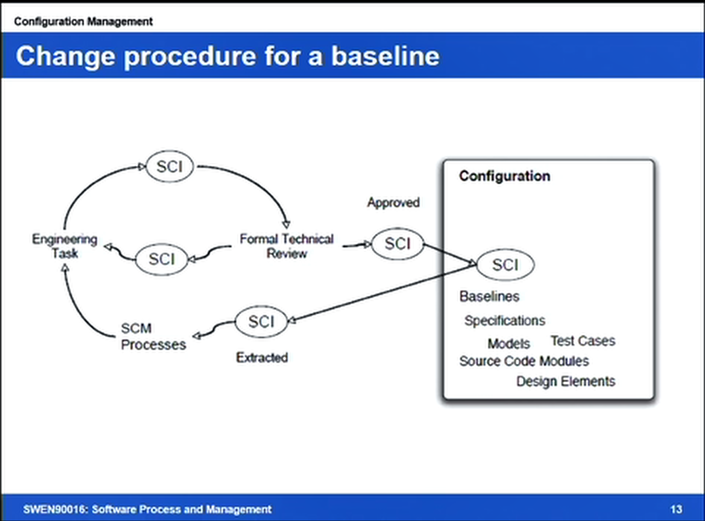

# Week 6 config mng

_updated at: 2017-05-22-21-09_

## intro and motivation
+ sw artifact
    + produced
+ sw config
    + the sum total of __all the artifacts__, their current __state__ and the __dependencies__ between them
+ what is config
    + how do you change
    + confirm ur change?
    + change control, change mng
    + all the artifxt that make the proj work
+ what is sw config mng
    * the discipline of ensuring that all artifacts contributing to the goals of the project are consistent with each other and their own goals
        * i.e change mng
            * what&where are sw __components__
            * what is the __status__ of each sw component
            * how does a change to one component __affect others__
            * how do we mng __request for change__
            * how do we resolve __conflicting changes__
            * how do we maintain multiple __versions__
            * how do we keep the sys __up to date__

## config mng tasks
+ identification
    * set of artifact - config items
        * basic (atomic) bojects  ->  basic (atomic) bojects  -compile->  derived obj
    + a typical set
        * req
            - req spec
            - req models
            - sections of the req spec
            - individual req
        * design
            - design models
            - design docs
            - design elems
            - class designs
        * code
            - src code and obj code modules
            - sw tools
            - frameworks and libs
        * testing
            - test drivers and slubs, and test srcipts
        * other doc
            - release notes
+ version mng
    * version control
        - repository for storing the items
        - version mng sys
            + repo for storing
            + ver mng func
                * create ver
                * track ver
                * rollback
            + a facility to bring all artifacts that belong to a config together
        - identifying a the config items and level of tracking is a proj mng/planning decision ... depend on the proj
    * version numbering
        - terminology
            + version
            + variant
            + release
+ change control
    * change could be due to
        - __discrepancies__
            + corrections or refinements of requirements
            + modifying, extending or correcting design or implementation
            + changing technology
        - __requsted change__
            + enhancements and additional features
            + changes to requiremnets
            + refinements of existing requirements
            + changes to design
    * Change Control Plan (CCP)
        - elems of a CCP
            + how to initiate change
            + how to eval change
            + how to impl change
        - baseline
            + an artefact or a config that is stable
                + has been formally reviwed and agreed upon
                + ready for use in future dev
            - can only be changed through formal change mng procedures
                + 
+ config auditing
    * audit ensures that the config mng processes have been followed
        - have the requested changes been approved
        - have the requested changes to dependencies taken place
        - many other relevant questions which depends on the process
    * more common for large and complex projs
+ config reporting (status reporting)