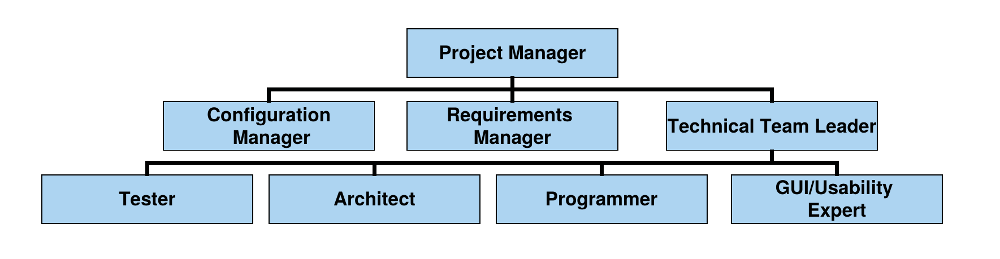
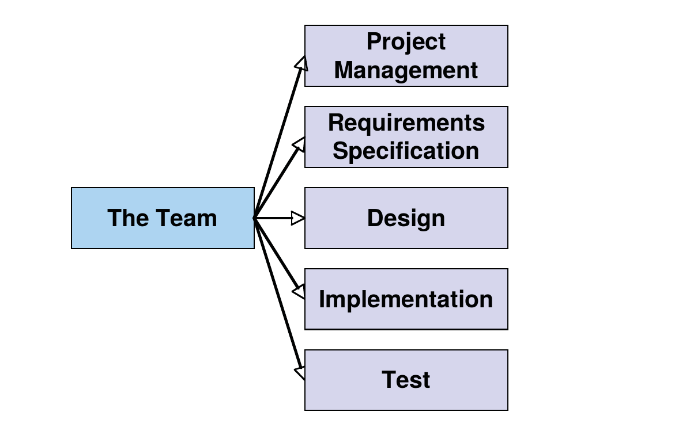
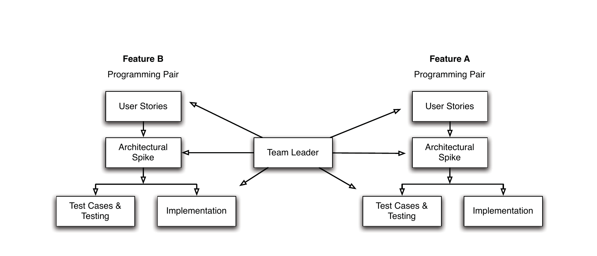

# Week 3  People and Teams

_updated at: 2017-03-17-21-13_

+ life cycle
    + engineering
        * requirement
        * architecture
        * design
        * implement
        * testing
    + management
        * resource
            - HR
            - tools
            - hareware
        * schedule
        * quality assurance
        * risk assurance
        * budget
        * configuration management
        * planning
            - Software Proj Mng Plan, SPMP
            - Proj Mng Plan, PMP
                + Proj Plan, PP
+ individual and their motivaiton
    * motivation of individual
        - organizational psychology
            + Mislow
                * __hierarchy of needs__
                    - drive our behaviours
                * the needs each level of the hierarchy must be satisfied as a prerequisite to attaining the needs at the next level
                * A satisfied need is no longer a motivation
            + Hertzberg
                * __hygiene:__ motivational factors
                    - achievement
                    - the work itself
                    - recognition
                    - responsibility
                    - personal growth
            + how can leader motivate people
                * influence
                    - 9 factors
                        + __work challenges__
                        + __experience__
                        + Authority
                        + Assignment
                        + Budget
                        + Promotion
                        + Money
                        + Penalty
                        + Friendship
                * power
                    - Coercive
                    - Legitimate
                    - Expert
                    - Reward
                    - Referent
    * improving effectiveness
        - 7 habits of highly effective people
            + wtf, why the science of success would be here
            + ~~attain independence~~
                * ~~Be proactive~~
                * ~~Begin with the end in mind~~
                * ~~Put first things first~~
            + ~~make independence more effectiveness~~
                * ~~Think win/win~~
                * ~~Seek first to understand then to be understood~~
                    - ~~listen before you talk~~
                * ~~Synergise~~
                    - ~~collaboration~~
                * ~~Sharpen the axe~~
                    - ~~better tools, even with learning time needed~~
+ teams and team dynamics
    * team
        - small group of people (2-12 usually)
        - complementary skills & experience
        - committed to a common purpose or goal
        - committed to a common approach
        - mutual accountability
    * why join
        - security
        - task complexity
        - social interaction
        - physical proximity
        - exchange
    * ~~defining a team~~
        - ~~a group of people withs shared norms and interlocking roles~~
            + norms
                * ~~formal~~
                * ~~informal~~
            + roles
                * ~~to understand team dynamics~~
                * role types
                    - task roles
                        + ~~Initiator~~
                        + ~~Information seeker~~
                        + ~~Information giver~~
                        + ~~Coordinator~~
                        + ~~Evaluator~~
                    - maintenance roles
                        + ~~Encourager~~
                        + ~~Harmoniser~~
                        + ~~Standard setter~~
                        + ~~Follower~~
                        + ~~Group observer~~
                    - destructive roles
                        + ~~Blocker~~
                        + ~~Recognition seeker~~
                        + ~~Dominator~~
                        + ~~Avoider~~
                        + ~~Free Rider~~
                        + ~~Lone Wolf~~
    * phases of group development
        - forming
        - storming
        - norming
        - performing
        - terminating
+ structuring teams: team structure and organization
    * types
        - Controlled Centralised (CC)
            + 
            + hierachical
            * sub-teams with leaders
            * communication is vertical
        - Controlled Decentralised (CD)
            + 
            + sub-teams with leaders
            + encourage horizontal communication between team and individuals
                * more autonomy than CC
        - Democratic Decentralised (DD) (innovative anarchy)
            + 
            + no permanent leader
            + a coordinator is appointed for short durations
            + requires a lot of communication (coordination overhead)
                + hard to manage
                + not suited to deliver products in a short time
        + SWAT (CD)
            + 
            * a highly specialized team put together for a particular task - e.g. build a quick prototype
        + ~~Chief Programmer Team (CC)~~
            + 
        + XP (eXtreme Programming) Team
            + 
            * feature driven
        + Scrum Team
            + 
            * controlled structure, but with a democratic decentralised team
    - comparison
        + 