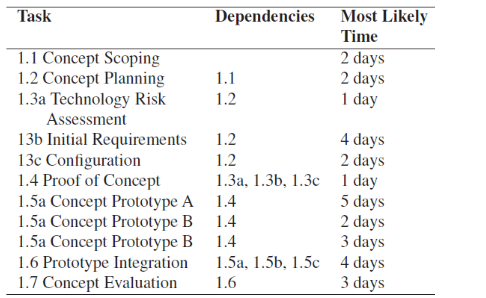

# Planning and Scheduling

## Project Plan
* proj mng plan `!=` proj plan
    - PMP contain all plans
    - proj plan is just about the schedule
+ What does it include
    * the __task__ that need to be carried out as part of the processes that are being followed
    * the __duration__ and __dependencies__ for each task
    * the __people__ and __physical res__ required by each task
    * __milestones__ or __goals__ of each task
        - milestones: particular __important__ achievements
            + to track progress

## Basic Plainning Concepts
+ Compartmentalise
    * break down into smaller pieces
+ Interdependency
    * are there any dependencies between tasks or resources
+ Effort Estimation/Validation
+ Time Allocation
+ Responsibilities
+ Outcomes/Goals
+ Milestones

## People and Effort
+ A common measure for estimating the effort for software is _man-months_ (more generally _person-months_)
+ person-moths
    * the time in months for a single person working full time to complete the tasks
+ The Mythical Man-Months
    * ~~man-months is a misleading measure to estimate software~~
    * ~~adding people to a project that is behind schedule could result in more
    damage than helping it~~
+ Putman-Norden-Rayleigh curve
    * ~~waste effort? time?~~
    * dev time too long, effort cost goes up

## Project Scheduling

### Work Breakdown
+ start by choosing the SDLC
+ Breakdown the work tasks - __Work Breakdown Structure__
    * e.g. waterfall model
        - Concept
        - Requirements
        - Design
        - Impl
        - Acceptance Testing
+ 100% rule
    * Work breakdown structure includes 100% of the work defined by the project scope and captures all deliverables — internal, external, and interim — in terms of the work to be completed, including all project management.

### Dependencies
+ Dependencies are caused by:
    * a task needing a work product of another task
    * a task needs resources used by another task
+ __Task Network__ captures the dependencies between tasks

### Task Network
+ 

### PERT and Gantt
+ Two widely used graphical notations to answer
    - how long will the sys take to dev
    - how much will it cost

#### Important concepts
+ Milestone
+ Activity
+ Free float, free slack
    * how long can a task be finished without affecting the next task
+ Total float, total slack
    * how much can I change without affect the whole schedule
+ Critical path
    * longest path
+ Critical activity
    * any activity in the critical path

#### PERT Charts
+ 
+ Program Evaluation and Review Technique charts
    + An activity network that shows the dependencies among tasks and the __critical path__.
    + Terminology
        - predecessor node
        - successor node
        - optimistic time (O)
        - pessimistic time (P)
        - most likely time (M)
        - expected time (TE)
        - $TE = (O+4M+P)/6$
    * node
        - 
    * dependencies
        - 

####  Gantt chart
+ A bar chart that show the schedule against a calendar
    - 
* Gantt How To
    - 
    - 

### Critical Path Methods
+ Critical path
    * path with the longest duration
    * activities on the critical path have a total free slack of 0
    * any activity gets longer, the total time gets longer
        - a delay in any of the activities in the critical path will cause the project to delay
+ Crashing the project plan
    + shortening the total duration of the project by shortening the critical path
        * By removing the dependencies between activities in the critical path; or 
        * Shortening the duration of activities in the critical path

### Project Tracking and Control
+ Period __reviews__ where team members report __progress__
+ __Evaluating__ the results of reviews and audits conducted as part of the software engineering process
+ Tracking formal project __milestones__
+ Comparing __actual start__ dates with scheduled start dates
+ Meeting __engineers__ and having informal discussions
+ Using a formal method like __earned value analysis__

### Common reasons for project failure
+ Unrealistic deadlines
+ Changing requirements
+ Underestimate of the efforts
+ Unmanaged risks
+ Technical difficulties
+ Human resource difficulties
+ Failure to see and act on slippage
+ Miscommunications between project staff

### Planning in agile development
+ Takes a significantly different flavour from traditional approaches
+ Detailed planning is differed __until the start__ of the iteration
    + Designed to handle __change__
    + An iteration includes __all phases__ (requirements, design and test)
+ Planning is based on __light weight lists__
    + Gantt and PERT charts are considered __less useful__
* Plan __short__ iterations
+ Produce useful functionality
+ Use “Just in time (__JIT__) planning” – next iteration
+ Use the __team__

