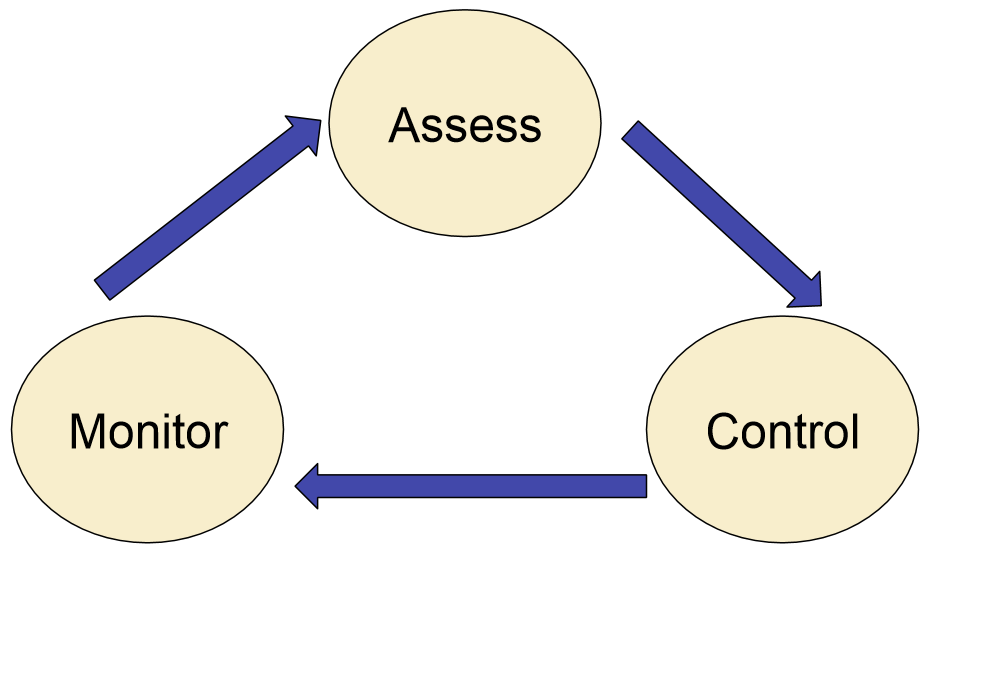

# Sample exam solution try

## Part A – Short Answer Questions
1. __What is the purpose of the Scrum Sprint Review, who is invited and when is it held during the Scrum life cycle?__
    + purpose
        + review the work that was completed and present it to the customer
    + who
        + the scrum team
    + when
        * after the sprint is complete
2. __What are the roles in a Scrum Team? What are the responsibilities of each role?__
    + Product Owner
        * represents the customer/stake-holders
            - writes user requirements in the form of User Stories, which are added to a Product Backlog, and these requirements are prioritised
    + Scrum Master
        * facilitates the sprint
            * _responsible for resolving any impediments the development team might face that could impact the sprint, and also ensures that the Scrum framework is followed._
        * is responsible for product goals and deliverables.
    + the Development Team
        * programming -- developing the software
3. __Describe the term burndown in the Scrum context.__
    + Burn Down show amount of work not done to track remaining effort
        + Y-axis is the remaining Story Points
        + X-axis is the elapsed time
4. __A life-cycle model in software engineering is a generic sequence of activities that can be used to achieve a goal. Discuss the main factors that should be taken into consideration when choosing a life-cycle model for a project.__ _???_
    + risk
    + duration
    + team experience 
5. __Influence and power are used by project managers to motivate people. Compare and contrast the role of influence and power in motivating people.__
    + Power and influence are closely related. Power is the ability to influence people’s behaviour to get them to do what they would not otherwise do. Power is much stronger than influence because it is often used to get people to change their behaviour. 
6. __Describe what risk is in the context of software engineering product development and briefly describe the three key iterative processes of risk management.__
    + A risk is a possible future event that has some expected impact.
    + three key iterative processes
        * 
        * Risk Monitoring
            - obeserving what is happening and when
        * Risk Assessment
            - identifying and analysing the risks to the project, and prioritising these risks based on our exposure to them.
        * Risk Control
            - removing, mitigating, accepting, or minimising the risks to the project.
7. __Compare and contrast the fields of computer science and software engineering. What are their similarities and differences?__
    + similarities _???_
        - use knowledge
        - to solve some problem
        - related to Information Technology
    + differences
        - critical difference
            + CS is a science, while SE is an engineering method.
            + CS is the theoretical foundation on which software engineering is built.
            + SE applies the results from computer science as problem-solving tools
        - inherent difference
            + complexity
                * CS: solve small-scale problems regarding certain computational problems
                * SE: build and manage large-scale systems
8. __agree or not and why__
    1. Proposition 1: The classical formal lifecycles of software engineering, such as the waterfall or increment models, are for stuffy old software engineering dinosaurs. The world has moved on, and agile practices are the only sensible way moving forward, because they focus on coding.
        + disgree
            * formal lifecycles aren't out-of-date
                * for example, spiral and increment model can still be very useful
                    - agile and increment model have similarities to some extent, they both try to accomplish some of functionalities and then the rest step by step
                    - spiral is risk-driven and it focus a lot on risk management, which makes it very appropriate for a high-risk, complex project
            * not only because focus on coding
                * customer involvement to make requirements more specific and accurate
                * short iteration to meet changing requirements
            * agile has drawbacks as well
                - requires experienced developers
                - a lot of discipline, can be hard to follow
                - The customer is required to provide a representative to the project in a full-time role
                - requires a lot of communications, not suitable when communications are inconvenient (e.g. under a global circumstance)
    2. Proposition 2: In risk management, all we really need is an estimate of the probability of a risky event occurring. The impact is not relevant because a low probability event is not worth considering.
        + disgree
            * both probability of a risky event and its impact should be taken into consideration. In fact, there is a term called "risk exposure", which is equal to probability * impact
            * an event with low probability but high impact may also need to be worried about
            * an event with high probability but low impact may not need to be concerned with
    3. Proposition 3: The only technique really needed for requirements elicitation are interviews.
        + disgree
            * interviews is one form of requirement investigation, other form (e.g. survey) exists as well
            * after investigation, critical thinking and analysing are needed to reveal the real/specific requirement
            * then need to confirm the requirements with the customers by requiremnt validation 

## Part B – Long Answer Questions
9. + __PERT chart__
   + __critical path__
10. __Use Ejiogu’s six attributes to compare and contrast Cyclomatic complexity and function-point analysis__
11. __Design a software development lifecycle model for a project. Justify your design with respect to 1. The key characteristics and goals for this project, and how your lifecycle models best fits the goals of the project. 2. The processes you would put in place to achieve the goals of each phase of your chosen lifecycle process.__
12. __What team structure would you use for the project? Justify your stance by arguing how your team structure suits the project goals, risks, and characteristics, and how it fits within the lifecycle process.__